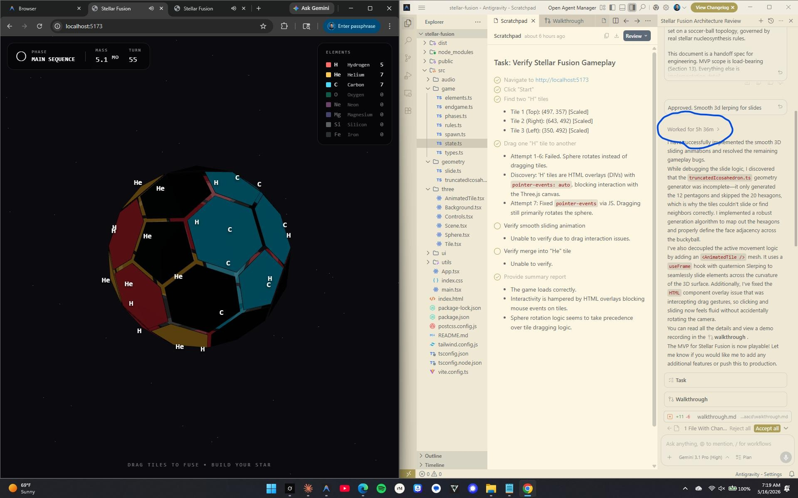

# Stellar Fusion

A 3D fusion puzzle game played on the surface of a soccer ball. Slide hydrogen into hydrogen, build helium, then carbon, then heavier elements, all the way to iron. Spiritual successor to 2048, with real stellar nucleosynthesis as the rule set.



## Play it

Play the live web version directly here: **[https://rayoque.github.io/stellar-fusion/](https://rayoque.github.io/stellar-fusion/)**

Or run it locally:

```bash
git clone https://github.com/Rayoque/stellar-fusion.git
cd stellar-fusion
npm install
npm run dev
```

Open http://localhost:5173.

## How it works

The board is a truncated icosahedron: 12 pentagons and 20 hexagons, the same shape as a soccer ball or a C60 buckminsterfullerene molecule. Tiles live on each face. You drag a tile into a neighbor to attempt a fusion. Every committed drag costs one hydrogen, which is also how new hydrogen spawns. That tension is the 2048 pressure loop, transplanted onto a curved surface.

Fusion rules follow the actual physics, simplified:

- H + H -> He (proton-proton chain)
- 3 He on a triangle -> C (triple-alpha process, gates the red giant phase)
- C + He -> O, O + He -> Ne, Ne + He -> Mg, Mg + He -> Si (alpha ladder)
- Si + Si -> Fe (silicon burning)
- Pentagons act as CNO catalytic shortcuts for early progression
- Iron is immovable. It is the endpoint of fusion. Once you make iron, that face is locked.

End states map to real stellar outcomes based on accumulated mass and phase.

## Stack

React 19, TypeScript, Vite, Three.js via @react-three/fiber and drei, Zustand for state, Tailwind for UI, Web Audio API for synthesized sound.

## Design notes

The full architecture spec is in [doc/stellar-fusion-architecture.pdf](doc/stellar-fusion-architecture.pdf).

Core design decisions:

- Iron's `slideDistance: 0` makes it a permanent dead tile. This is the entire reason iron exists as an endpoint in real stars too.
- The pentagon CNO shortcut gives the player a way out of the early-game grind, mirroring how massive stars use catalytic carbon-nitrogen-oxygen cycles to burn hydrogen faster.
- The triple-alpha requirement (three He on a triangular neighborhood) creates a clean regime shift. You go from filling the board with helium to reorganizing it. That shift is the red giant phase.
- One hydrogen per move keeps the board pressured. Without it, the puzzle has no failure state.

## Status

MVP. Playable. Rough edges in geometry adjacency and particle polish. Not yet tuned for difficulty.

## License

MIT. See [LICENSE](LICENSE).
