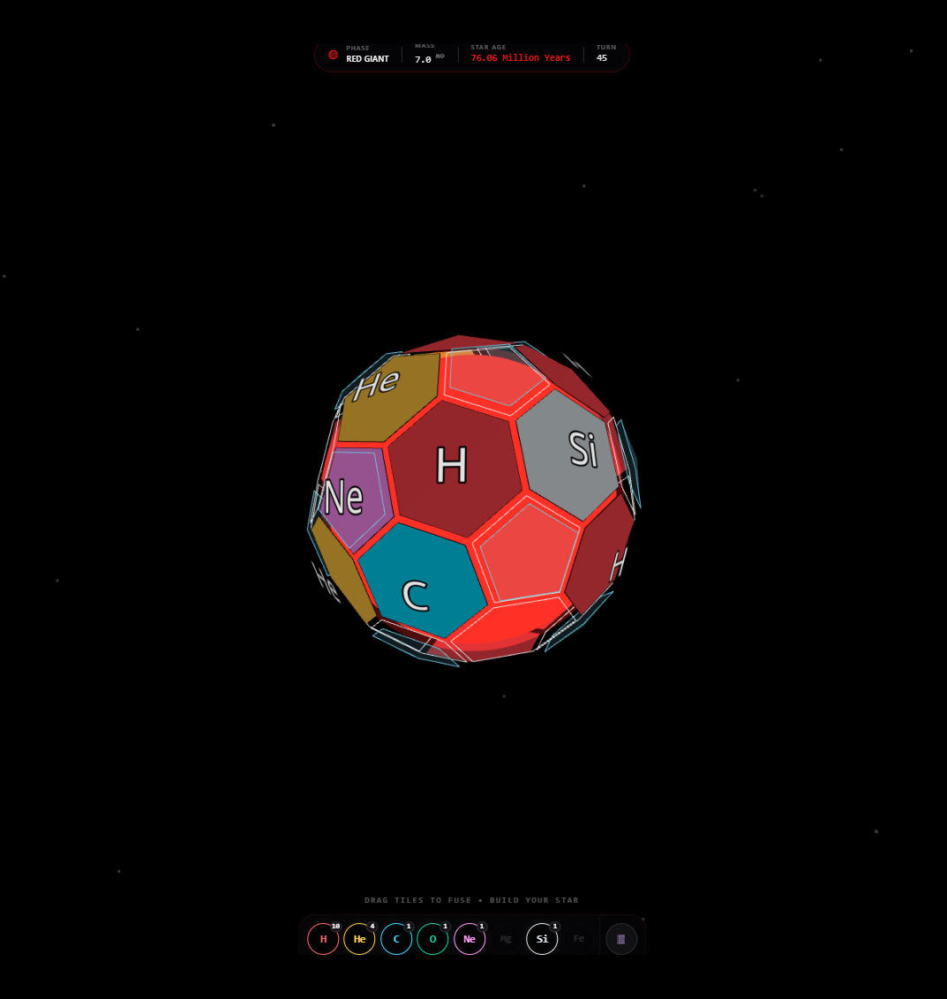
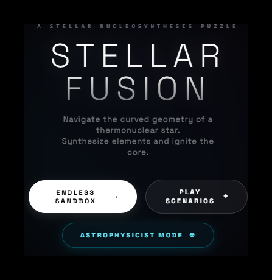
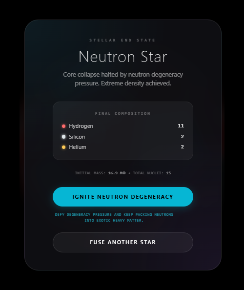
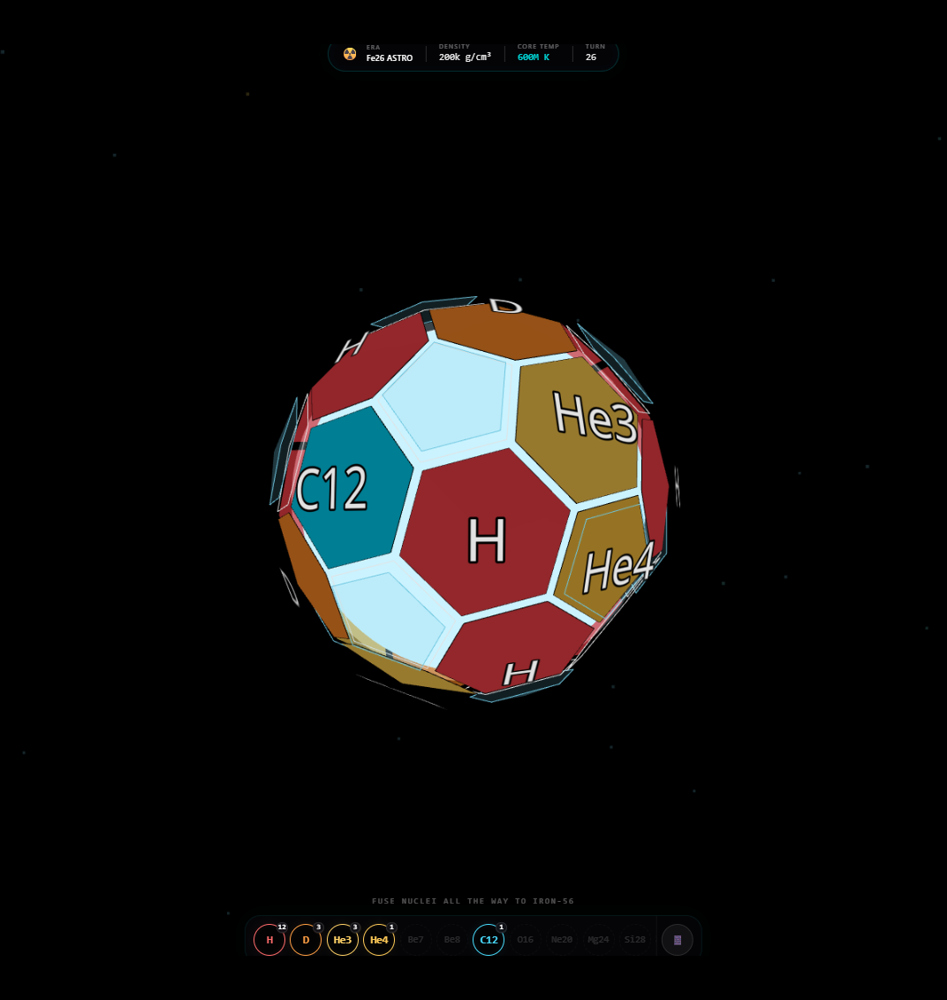
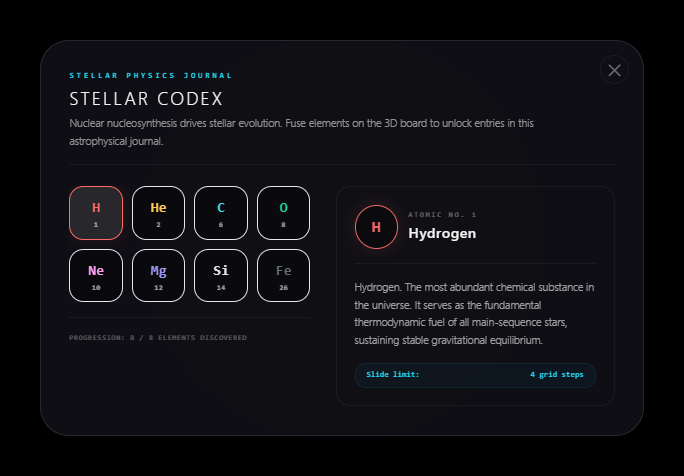
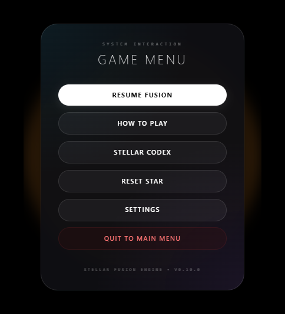

# Stellar Fusion

A 3D nucleosynthesis puzzle played on the surface of a soccer ball. Slide hydrogen into hydrogen to build helium, then carbon, then heavier elements, all the way to iron. A spiritual successor to 2048, with real stellar physics as the rule set.



## Play it

Play the live web version directly here: **[https://rayoque.github.io/stellar-fusion/](https://rayoque.github.io/stellar-fusion/)**

Or run it locally:

```bash
git clone https://github.com/Rayoque/stellar-fusion.git
cd stellar-fusion
npm install
npm run dev
```

Open http://localhost:5173.

## Modes

Three ways to play, selectable from the start screen:



- **Endless Sandbox** — open-ended play. Fuse as far up the chain as the board allows and chase a high score.
- **Stellar Campaign** — ten curated scenarios, each with a fixed starting layout, a turn limit, and a specific fusion objective. Difficulty ramps from a first helium fusion up to balancing every stable element at once.
- **Astrophysicist Mode** — an advanced mode that unlocks once the campaign is complete. It swaps the rule set for a full isotope chain. (Inspired by [Fe26](https://dimit.me/Fe26/) — see Credits.)

## How fusion works

The board is a truncated icosahedron: 12 pentagons and 20 hexagons, the same shape as a soccer ball or a C60 buckminsterfullerene molecule. Tiles live on each face. Dragging a tile into a neighbor attempts a fusion. Every committed drag costs one hydrogen, which is also how new hydrogen spawns — that is the 2048 pressure loop, transplanted onto a curved surface.

Fusion rules follow the actual physics, simplified:

- H + H -> He (proton-proton chain)
- 3 He on a triangle -> C (triple-alpha process, gates the red giant phase)
- C + He -> O, O + He -> Ne, Ne + He -> Mg, Mg + He -> Si (alpha ladder)
- Si + Si -> Fe (silicon burning)
- Pentagons act as CNO catalytic shortcuts for early progression
- Iron is immovable. It is the endpoint of fusion. Once you make iron, that face is locked.

The star advances through phases (main sequence, red giant, and beyond) as mass and composition change, and the run ends in a real stellar outcome — white dwarf, neutron star, or black hole — depending on the accumulated mass.

## Campaign

Each scenario sets the stellar mass, a turn budget, and an objective, then drops you into a tailored board.


Runs resolve into an end state screen summarizing the final composition and outcome.



## Astrophysicist Mode

The unlockable advanced mode runs a detailed isotope chain (deuterium, the helium isotopes, the beryllium bottleneck, and up through the heavier nuclei toward iron-56) rather than the simplified ladder.



## Codex & menu

A Stellar Codex tracks each element synthesized so far, with a short physics note and the slide rules for every tile. The in-game menu covers resume, how-to-play, the codex, reset, and settings.





## Stack

React 19, TypeScript, Vite, Three.js via @react-three/fiber and drei, Zustand for state, Tailwind for UI, Web Audio API for synthesized sound.

## Design notes

The original architecture spec is in [doc/stellar-fusion-architecture.pdf](doc/stellar-fusion-architecture.pdf).

Core design decisions:

- Iron's `slideDistance: 0` makes it a permanent dead tile. This is the entire reason iron exists as an endpoint in real stars too.
- The pentagon CNO shortcut gives a way out of the early-game grind, mirroring how massive stars use catalytic carbon-nitrogen-oxygen cycles to burn hydrogen faster.
- The triple-alpha requirement (three He on a triangular neighborhood) creates a clean regime shift, from filling the board with helium to reorganizing it. That shift is the red giant phase.
- One hydrogen per move keeps the board pressured. Without it, the puzzle has no failure state.

## Status

Playable and in active development, with three modes and a ten-level campaign. Active areas of work: geometry adjacency edge cases, particle polish, and difficulty tuning.

## Future plans

- A more challenging, heavily curated Puzzle Mode campaign, inspired by world-class puzzle design.
- Haptic feedback, with a no-ads release on the Apple App Store.
- Broader compatibility across devices.

Feedback is very much appreciated — open an issue or reach out.

## Credits & Inspiration

The advanced unlockable **Astrophysicist Mode** is directly inspired by and modeled after the nucleosynthesis browser game **[Fe26](https://dimit.me/Fe26/)** by [Dimitri](https://dimit.me/). The original is well worth a look for anyone interested in stellar core fusion puzzle logic.

## License

MIT. See [LICENSE](LICENSE).
